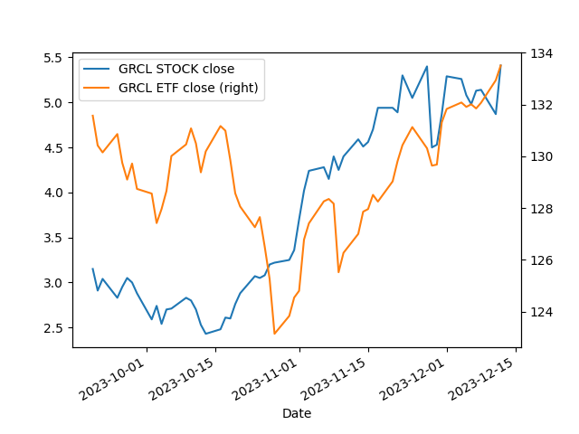

> This project is designed solely for educational purposes.

## setup

```bash
python -m pip install -r requirements.txt
```

## config

Expression can be checked online at [https://crontab.cronhub.io](https://crontab.cronhub.io)

```yaml
on:
  schedule:
    - cron: '0 6 * * 2-6'
```

## usage

```python
import pandas as pd

base_url = 'https://raw.githubusercontent.com/mmiliukas/screeners/main'

all = pd.read_csv(f'{base_url}/all.csv', parse_dates=['Date'])
tickers = pd.read_json(f'{base_url}/all-tickers.json')
ticker_AAGH = pd.read_json(f'{base_url}/tickers/AAGH.json')
```

### screener results

```python
all = pd.read_csv(f'{base_url}/all.csv', parse_dates=['Date'])

'''
 #   Column             Non-Null Count  Dtype
---  ------             --------------  -----
 0   Symbol             1025 non-null   object
 1   Name               1025 non-null   object
 2   Price (Intraday)   1025 non-null   float64
 3   Change             1025 non-null   float64
 4   % Change           1025 non-null   float64
 5   Volume             1025 non-null   int64
 6   Avg Vol (3 month)  1025 non-null   int64
 7   Market Cap         1025 non-null   int64
 8   Date               1025 non-null   datetime64[ns]
 '''

#  get unique symbols
all['Symbol'].unique()


# sorty by % Change
all.sort_values(by=['% Change'], ascending=False)[['Symbol', '% Change']]

'''
    Symbol  % Change
386   PSCO    550.00
83    PSCO    550.00
145   PSCO    550.00
610   PSCO    550.00
763   PSCO    550.00
..     ...       ...
248   EKSN      0.00
393   EKSN      0.00
131  RTMFF      0.00
244  TLSIW     -7.69
915   BYSD    -22.76
'''

# filter rows by condition
all[all['% Change'] > 50]

'''
     Symbol                          Name  ...  Market Cap                       Date
4     KROEF                       KR1 Plc  ...   203975000 2023-12-08 19:07:18.414773
11     EXOD         Exodus Movement, Inc.  ...           0 2023-12-08 19:07:18.414773
29     TNRG  Thunder Energies Corporation  ...     7872000 2023-12-08 19:07:22.287810
36    OLVRF         Olivut Resources Ltd.  ...     5156000 2023-12-08 19:07:22.287810
43    CPPMF         COPPERNICO METALS INC  ...           0 2023-12-08 19:07:22.287810
...     ...                           ...  ...         ...                        ...
991   GXUSF     Guardian Exploration Inc.  ...    24501000 2023-12-08 22:08:15.541271
995    TNRG  Thunder Energies Corporation  ...     7872000 2023-12-08 22:08:15.541271
1001  OLVRF         Olivut Resources Ltd.  ...     5156000 2023-12-08 22:08:15.541271
1007  CPPMF         COPPERNICO METALS INC  ...           0 2023-12-08 22:08:15.541271
1015  KROEF                       KR1 Plc  ...   203975000 2023-12-09 08:10:19.965670
'''

```

### ticker results

```python
# gives short information about the tickers
# mainly used for industry and sector information
tickers = pd.read_json(f'{base_url}/all-tickers.json')

# get full details about the ticker
ticker_AAGH = pd.read_json(f'{base_url}/tickers/AAGH.json')

tickers[['symbol', 'industryKey', 'sectorKey', 'volume']]

'''
     symbol           industryKey        sectorKey  volume
0     PTPIF   specialty-chemicals  basic-materials    5000
1      AAGH         biotechnology       healthcare  111100
2     IPDQF       medical-devices       healthcare   30000
3     ALGEF               uranium           energy  126000
4     WONDF  software-application       technology  623817
...     ...                   ...              ...     ...
1020   BTCM                                         166363
1021   XELB                                          99068
1022   POSC                                          53186
1023   PRTT                                         204647
1024   GBAT                                           1584
'''
```

## correlation

```python
python yahoo-correlation.py
```



```
correlation for GRCL = 2.0130538335026253
```